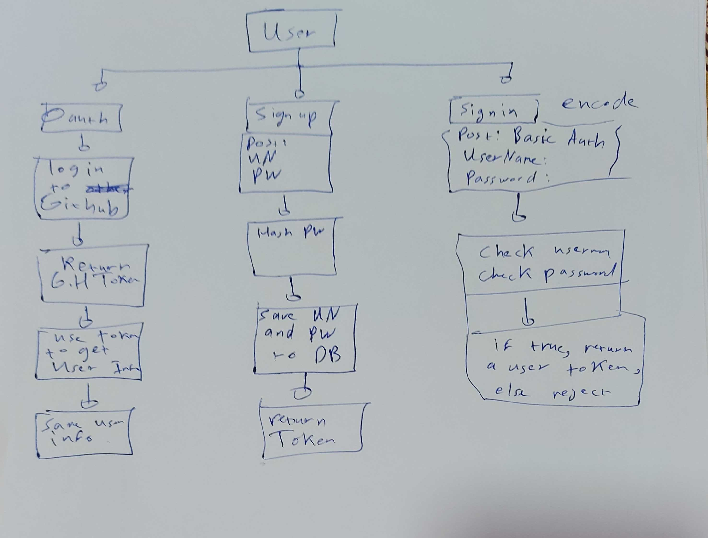

# LAB - 11

## Authentication

### Author: Ammar Badwan

### Links and Resources

- [Pull Request](https://github.com/ammarBadwan-401-advanced-javascript/auth-server/pull/1)
- [GitHub Actions CI](https://github.com/ammarBadwan-401-advanced-javascript/auth-server/actions)

### Modules

* `./src/server.js`
* `./src/middleware/basic.js`
* `./src/auth/models/user-schema.js`
* `./src/auth/router.js`
* `./src/404.js`
* `./src/500.js`
* `./src/logger.js`
* `./src/timestamp.js`

### How to initialize the application

* `json-server --watch ./data/db.json` --> To start the server with that database file using json-server
* `node index.js` --> To start the server using express

* For the routes:
* For **GET**: `localhost:PORT/users` loads all users.
* For **POST**: `localhost:PORT/signup` to sign a new account , `localhost:PORT/signin`, to sign into an account.

### Tests

* Lint test: `npm run lint`.
* Unit test: `npm test`.

### UML 
* 